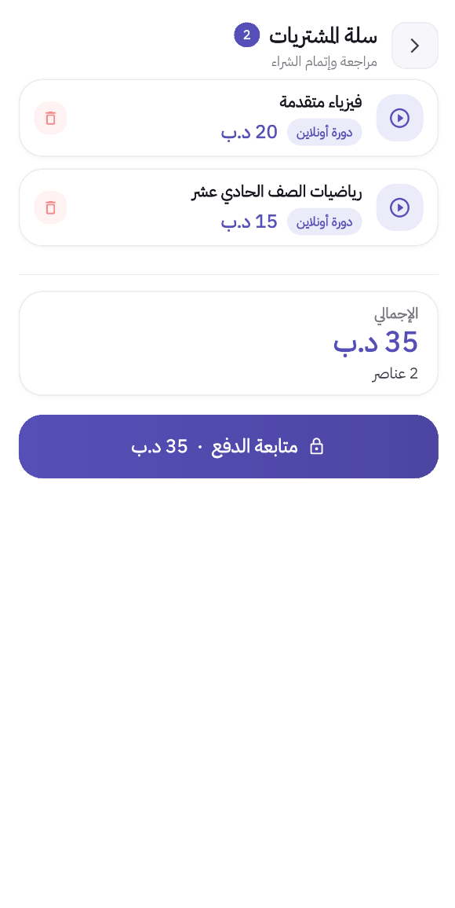

# Educational Platform — Flutter + Supabase

A full-featured educational platform connecting students with teachers, built with Flutter and Supabase.

> UI is in Arabic (RTL). The app targets the Bahraini market but the codebase is framework-agnostic.

---

## Screenshots

<div align="center">
  <table>
    <tr>
      <td width="33%"></td>
      <td width="33%"></td>
      <td width="33%"></td>
    </tr>
    <tr>
      <td align="center"><strong>Welcome</strong></td>
      <td align="center"><strong>Login</strong></td>
      <td align="center"><strong>Student Home</strong></td>
    </tr>
  </table>
</div>

<div align="center">
  <table>
    <tr>
      <td width="33%"></td>
      <td width="33%"></td>
      <td width="33%"></td>
    </tr>
    <tr>
      <td align="center"><strong>Online Courses</strong></td>
      <td align="center"><strong>Cart</strong></td>
      <td align="center"><strong>Timetable</strong></td>
    </tr>
  </table>
</div>

---

## Features

**Student**

- Browse and purchase courses and PDF books
- Watch live sessions and recordings
- Personal school timetable (stored locally)
- Chat with teachers
- Book private lessons
- Push notifications

**Teacher**

- Manage courses and books
- Live broadcast via Agora RTC
- Upload recordings
- Chat with students
- Dashboard stats

---

## Tech Stack

| Package           | Purpose                   |
| ----------------- | ------------------------- |
| Flutter 3.x       | UI framework              |
| Riverpod          | State management          |
| Supabase          | Database + Auth + Storage |
| Agora RTC SDK v6  | Live streaming            |
| Tap Payments      | Payments (Bahrain)        |
| SharedPreferences | Local storage             |

---

## Setup

### Prerequisites

- Flutter 3.x / Dart 3.x
- A [Supabase](https://supabase.com) project
- An [Agora](https://console.agora.io) project (for live streaming)
- A [Tap Payments](https://www.tap.company) account (for payments)

### 1. Clone

```bash
git clone https://github.com/YOUR_USERNAME/YOUR_REPO.git
cd YOUR_REPO/my_app
```

### 2. Configure Supabase

Edit `my_app/lib/core/config/supabase_config.dart`:

```dart
class SupabaseConfig {
  static const String supabaseUrl = 'https://YOUR_PROJECT_REF.supabase.co';
  static const String supabaseAnonKey = 'YOUR_SUPABASE_ANON_KEY';
}
```

Find your credentials at: **Supabase Dashboard → Project Settings → API**

### 3. Configure Agora

Edit `my_app/lib/core/config/agora_config.dart`:

```dart
static const String appId = 'YOUR_AGORA_APP_ID';
```

### 4. Configure Tap Payments

Edit `my_app/lib/core/config/tap_config.dart`:

```dart
static const String redirectUrl = 'https://YOUR_DOMAIN/payment-complete';
```

Store the secret key as a Supabase Edge Function secret — never in the app:

```bash
supabase secrets set TAP_SECRET_KEY=sk_live_...
```

### 5. Run

```bash
cd my_app
flutter pub get
flutter run
```

---

## Database

### Tables (15)

```
users · subjects · courses · books · enrollments · book_purchases
live_sessions · messages · conversations · payments · cart
announcements · notifications · teacher_availability · private_lesson_bookings
```

Full schema: [`supabase/schema.sql`](supabase/schema.sql)

### Storage Buckets

| Bucket            | Access  |
| ----------------- | ------- |
| avatars           | Public  |
| course-thumbnails | Public  |
| books             | Private |
| recordings        | Private |

### Required RLS Policies

Run these in the **Supabase SQL Editor**:

```sql
-- Allow unauthenticated clients to look up a user by phone (needed for login)
CREATE POLICY "anon_phone_lookup"
  ON public.users FOR SELECT TO anon USING (true);

-- Allow cart operations
CREATE POLICY "allow_cart_all"
  ON public.cart FOR ALL TO anon, authenticated
  USING (true) WITH CHECK (true);

-- Allow teachers to manage their own live sessions
CREATE POLICY "teachers_can_manage_sessions"
  ON public.live_sessions FOR ALL TO authenticated
  USING (teacher_id = auth.uid()) WITH CHECK (teacher_id = auth.uid());

-- Storage policies
CREATE POLICY "books_allow_all_authenticated"
  ON storage.objects FOR ALL TO authenticated
  USING (bucket_id = 'books') WITH CHECK (bucket_id = 'books');

CREATE POLICY "recordings_allow_all_authenticated"
  ON storage.objects FOR ALL TO authenticated
  USING (bucket_id = 'recordings') WITH CHECK (bucket_id = 'recordings');
```

---

## Project Structure

```
my_app/lib/
├── core/config/          # Supabase, Agora, Tap, theme tokens
├── domain/models/        # 15 data models (domain layer)
└── presentation/
    ├── providers/        # 20+ Riverpod providers
    ├── screens/
    │   ├── shared/       # Login, OTP, Welcome
    │   ├── student/      # 18 student screens
    │   └── teacher/      # 8 teacher screens
    └── widgets/          # Shared UI components
```

---

## Authentication

Real Supabase Phone OTP flow (`+973XXXXXXXX` format for Bahrain).

- Students can self-register
- Teachers are created by an admin only
- After OTP verification: teachers route to `TeacherHomePage`, students to `HomePage`

---

## Live Streaming

- Requires a **real device** — emulators have no camera
- Teacher: broadcaster role (camera + audio)
- Student: audience role (watch + listen)
- Agora token is empty string in dev mode — add server-side token generation before production

---

## E2E Testing (Maestro)

Tests are in `.maestro/flows/`. Requires [Maestro](https://maestro.mobile.dev) v2.6.0+.

Before running, replace the `XXXXXXXX` placeholders in the subflow files with your own test account phone numbers.

```bash
# Run all flows (Android emulator must be running)
maestro test .maestro/flows

# Run a single flow
maestro test .maestro/flows/01_student_login.yaml
```

---

## License

MIT — see [LICENSE](LICENSE) for details.
